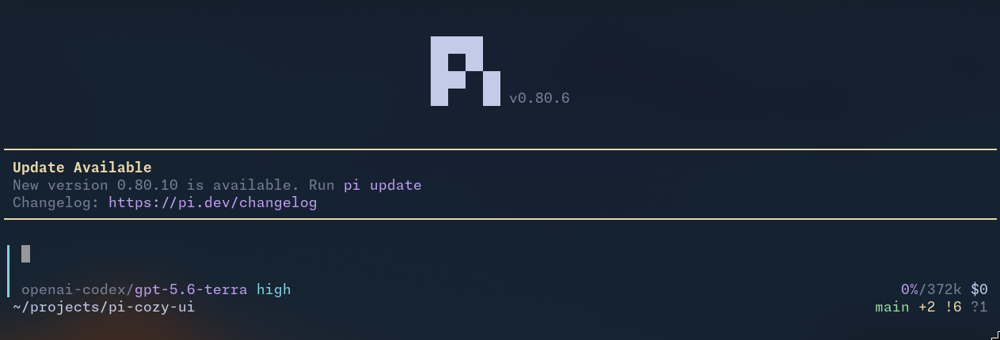

# pi-cozy-ui

A cozy UI for [pi](https://pi.dev) — a minimal left-bar input box, startup screen, and pastel themes.

## Install

```bash
pi install git:github.com/wannfq/pi-cozy-ui
```

Then enable/disable modules in the resource config TUI:

```bash
pi config
```

## Themes

The package includes two Catppuccin-inspired pastel themes that also style the
thinking-level input border:

- `pastel-dark` — a soft Mocha-inspired dark palette
- `pastel-light` — a warm Latte-inspired light palette

Select either theme from `/settings` after installation.

## Recommended settings

Enable quiet startup to suppress Pi's default startup banner — the startup screen module replaces it with a cleaner centered header:

```bash
pi config
```

In the config TUI, set `quietStartup` to `true`. Or add it directly to `~/.pi/agent/settings.json`:

```json
{
  "quietStartup": true
}
```

## Preview



## Develop

```bash
pnpm install
pnpm dev
# = pi --no-extensions -e ./extensions/input-field.ts -e ./extensions/startup-screen.ts
```

Edit, then type `/reload` inside pi for live updates.

## Layout

| File | Purpose |
| --- | --- |
| `extensions/input-field.ts` | Custom editor: left-bar input box with an embedded muted status row. |
| `extensions/startup-screen.ts` | Startup header: centered ASCII "pi" icon and version. |
| `lib/text-layout.ts` | Pure ANSI-aware text helpers used by both extensions. |
| `lib/chrome-layout.ts` | Pure composer for the minimal editor chrome. |
| `themes/pastel-dark.json` | Catppuccin-inspired dark theme. |
| `themes/pastel-light.json` | Catppuccin-inspired light theme. |

## Test

```bash
pnpm test
```

## Type-check

```bash
pnpm check
```
